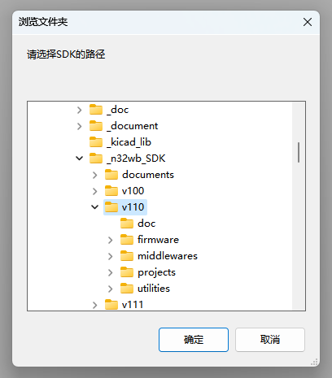
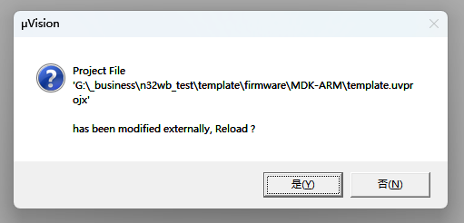

# N32WB031 测试与模板工程

商务合作联系邮箱（深圳）：xianyi.xia@outlook.com

**本项目包含[Firmware](#Firmware)固件与[Web-BLE](#Web-BLE)前端两个项目。**

## Firmware

本项目基于`N32WB031_STB_V1.1`开发板，开发板相关资料见[assets](./assets)文件夹。

本项目当前适用于`v1.1.0`版本SDK.

固件项目目前只支持`Keil`开发环境。

### 编译方法

为了使得`Keil`项目能够支持宏路径，本项目引入了 [KeilHelper](https://github.com/Nigh/Keil_MacroPath_Helper) 工具。

打开`Keil`项目，第一次点击编译，会弹出窗口选择SDK路径。

选择了有效的SDK路径并确定后。Keil会提示重载项目。点击确定后，即可正常编译项目。

[KeilHelper](https://github.com/Nigh/Keil_MacroPath_Helper) 的更多用法可参阅项目页面。

### 服务

包含以下蓝牙服务

- DIS(`0x180A`)
- BAS(`0x180F`)
- 自定义透传 (`0xCC00`)
  - Notify(`0xCC02`)
  - WriteWithoutResponce(`0xCC01`)

### IO

- LED1(`PB0`)
- LED2(`PA6`)
- BUTTON1(`PB1`)
- BUTTON2(`PB2`)
- LOG: USART:115200 (`PB6/PB7`)

### Usage

烧录完成后，重启EV板，即可观察到`LED1`与`LED2`交替闪烁。此时不会进入`sleep`状态，保持`SWD`接口可用，方便烧录。

在此时按下`Button1`或`Button2`后，测试固件将会开始运行。

开始运行程序后，使用[Web-BLE](#Web-BLE)应用可以与开发板连接。在应用中可以控制LED的闪烁与开关。并且应用也会将`Button1`和`Button2`的状态实时地反映在界面上。

### Known issues

本项目使用的`v1.1.0`版本的SDK在编译时，会有两个SDK文件报出共5个Warning，其中`n32wb03x_qflash.c`文件3个，分别在`181`，`199`和`219`行，原因均为定义而未使用的变量。`rtdss_16bit_task.c`文件2个，分别在`345`与`390`行，原因同上。

以上编译警告不影响功能，暂时忽略即可。期待后续的SDK更新能够修复上述问题。

## Web-BLE

注意！！！此应用仅兼容部分浏览器与环境，兼容性列表参见 https://developer.mozilla.org/en-US/docs/Web/API/Web_Bluetooth_API#browser_compatibility

建议在`Windows`、`Linux`和`Android`平台上使用最新版本的`Chrome`以获取良好体验。

无法自行构建Web应用的用户可以使用上述的平台与浏览器点击访问本人搭建的 [在线应用](https://app.tecnico.cc/n32wb_evb/) 直接使用。

### Env

- React
- yarn
- vite
  - vite-plugin-windicss
  - vite-plugin-pwa
- mui
- mobx

项目使用了[React](https://reactjs.org/)前端框架构建，引入了[yarn](https://yarnpkg.com/)包管理器和前端工具[Vite](https://vitejs.dev/)作为基础环境。

UI库使用了[mui](https://mui.com/)，并由[Vite](https://vitejs.dev/)插件[vite-plugin-windicss](https://github.com/windicss/vite-plugin-windicss)引入了[windicss](https://windicss.org/)样式框架。

组件通信与状态同步使用了[mobx](https://mobx.js.org/)包。

整个应用通过[Vite](https://vitejs.dev/)插件[vite-plugin-pwa](https://github.com/antfu/vite-plugin-pwa)实现了PWA化。

### Install

`yarn install`

### Debug

`yarn start`

### Build

`yarn build`

### Usage

点击`Scan`按钮配对设备后，将会出现设备框架，点击`Connect`即可连接。

正常连接后，将可以使用设备框架中的按钮来控制开发板上的LED，并且开发板上`Button1`和`Button2`两个按钮的状态也将实时反映在应用的界面上。

点击`LED2 ON`与`LED2 OFF`按钮可以控制对应LED的亮灭。

点击`LED1 BLINK`按钮可以使对应LED开始闪烁，直到点击`LED OFF`按钮。

按下与松开`开发板`上的`Button1`与`Button2`，应用界面上的按钮会实时反映它们的状态。

