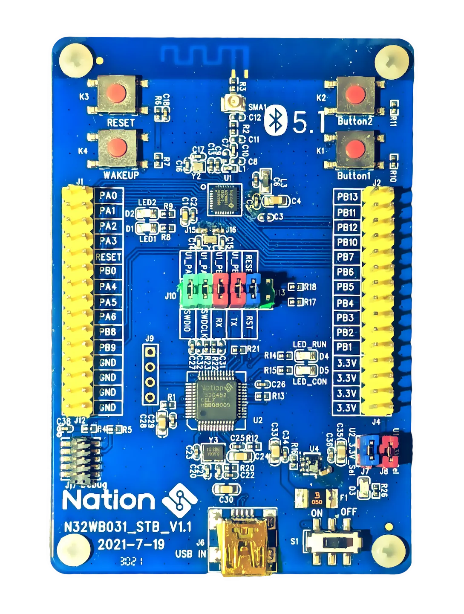
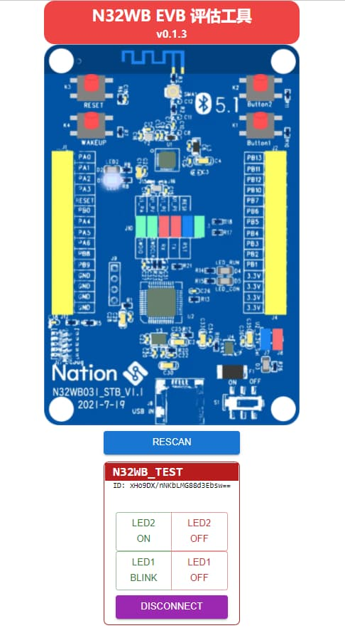

# N32WB031 模板工程

**本项目包含[Firmware](#Firmware)与[Web-BLE](#Web-BLE)前端两个项目。**

## Firmware

本项目基于`N32WB031_STB_V1.1`开发板，开发板相关资料见[assets](./assets)文件夹。

固件项目目前只支持`Keil`开发环境。

> 在v1.0版本的SDK中，存在一个bug，可能会导致io配置被意外更改。
>
> 修复方法为更改sdk中log usart的deinit函数。其41行的结构体需要先进行初始化。
>
> 在之后版本的sdk中会修复。

**注意！！！ 由于`Keil`不支持路径宏，故为了将项目与SDK去耦合，所有的`include`路径都替换成了绝对路径，当在其他环境使用时，需要将`template.uvprojx`工程文件中的所有的对应路径替换为SDK的实际路径。**

### 服务

包含以下蓝牙服务

- DIS(`0x180A`)
- BAS(`0x180F`)
- 自定义透传 (`0xCC00`)
  - Notify(`0xCC02`)
  - WoR(`0xCC01`)

### IO

- LED1(`PB0`)
- LED2(`PA6`)
- BUTTON1(`PB1`)
- BUTTON2(`PB2`)
- LOG: USART:115200 (`PB6/PB7`)

### Usage

由于此IC在`Sleep`状态无法访问`SWD`，所以上电后两灯交替闪烁，处于激活状态，方便烧录，按下`BUTTON1`或`BUTTON2`后才开始运行程序。

开始运行程序后，使用[Web-BLE](#Web-BLE)应用可以与开发板连接。在应用中可以控制LED的闪烁与开关。并且应用也会将`Button1`和`Button2`的状态实时地反映在界面上。

## Web-BLE

注意，此应用仅兼容部分浏览器与环境，兼容性列表参见 https://developer.mozilla.org/en-US/docs/Web/API/Web_Bluetooth_API#browser_compatibility

建议在`Windows`、`Linux`和`Android`平台上使用最新版本的`Chrome`以获取良好体验。

### Env

- React

- yarn

- vite
  - vite-plugin-windicss
  - vite-plugin-pwa
- mui
- mobx

项目使用了[React](https://reactjs.org/)前端框架构建，引入了[yarn](https://yarnpkg.com/)包管理器和前端工具[Vite](https://vitejs.dev/)作为基础环境。

UI库使用了[mui](https://mui.com/)，并由[Vite](https://vitejs.dev/)插件[vite-plugin-windicss](https://github.com/windicss/vite-plugin-windicss)引入了[windicss](https://windicss.org/)样式框架。

组件通信与状态同步使用了[mobx](https://mobx.js.org/)包。

整个应用通过[Vite](https://vitejs.dev/)插件[vite-plugin-pwa](https://github.com/antfu/vite-plugin-pwa)实现了PWA化。

### Install

`yarn install`

### Debug

`yarn start`

### Build

`yarn build`

### Usage

点击`Scan`按钮配对设备后，将会出现设备框架，点击`Connect`即可连接。

正常连接后，将可以使用设备框架中的按钮来控制开发板上的LED，并且开发板上`Button1`和`Button2`两个按钮的状态也将实时反映在应用的界面上。

